# Next JS from Front to Back 2024

React Server components
File based routing
API Routes
Next Auth - Google provider - for Authentication
Cloudinary - Image storage and optimization

## Project Name: Property pulse

## What is Next JS?

- SSR and SSG
- Open source framework for building React-based applications with server-side rendering and static website generation

## Basics

- by default files are rendered from Server - Server components
- until explicitly marked `use client` in a file - Client components

- app/layout.jsx - entry point to the app
  - contain the app's main meta data declaration for SEO optimization
- app/page.jsx - Homepage of the app

- file based routing and app folder based routing (current)
  

- `<a href="/route">click me</a>` - a tags reloads page
- `Link from 'next/link` - doesn't reload page

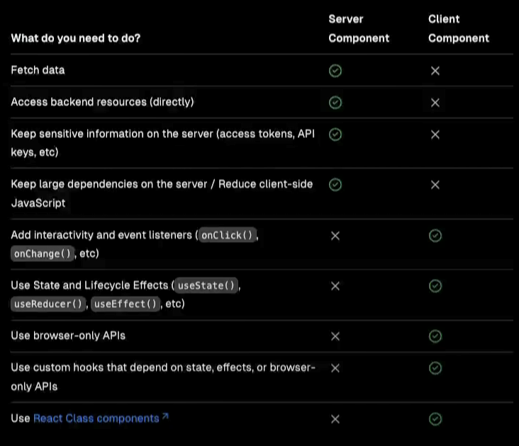

- server component console.log() - logs in server not in client

- use... anything will give ERROR when it is an server component (hooks)

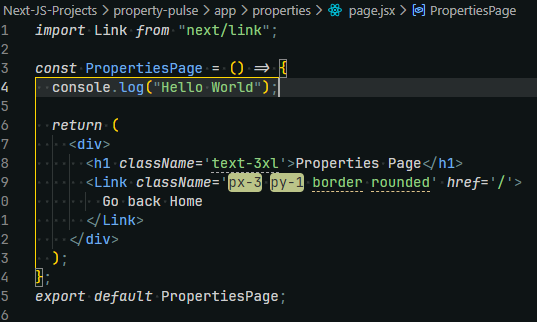
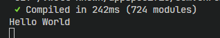

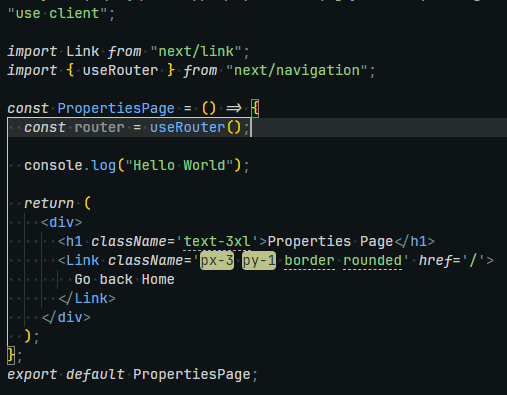
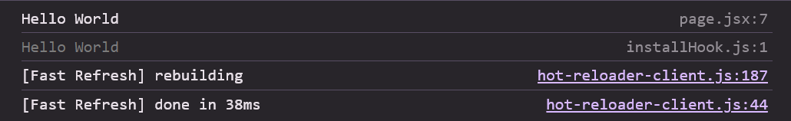

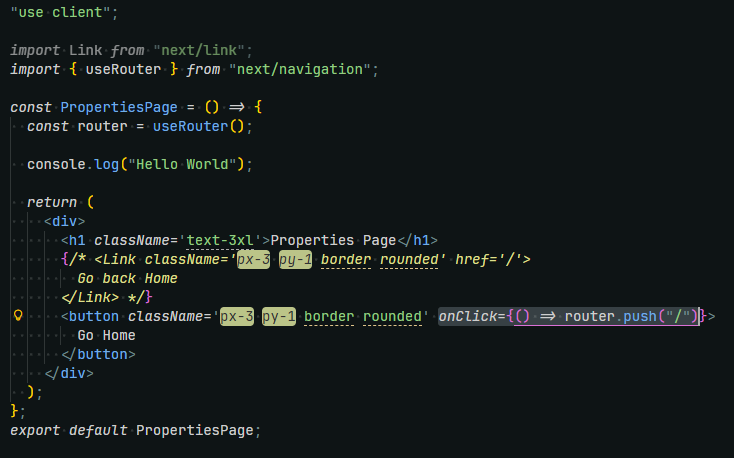

### Next.js - hooks

- `useRouter()`
- `useParams()` - gets parameters in URL (:id)
- `useSearchParams()` - like getting query form URL (?name=john)
- `usePathname()` - gets the route URL (/properties/300?name=Brad)

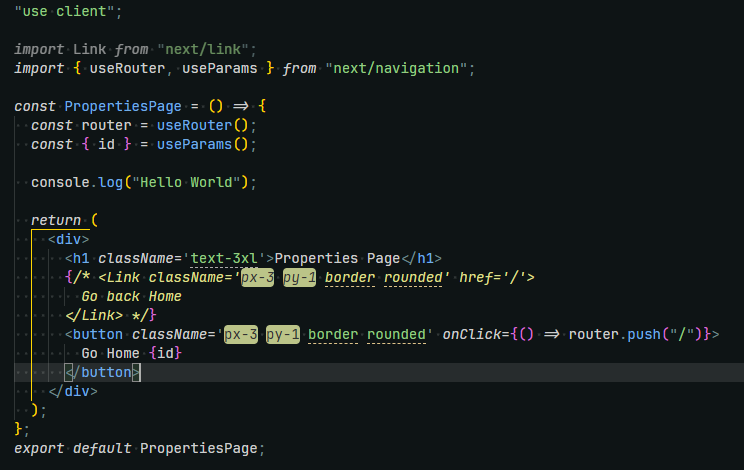
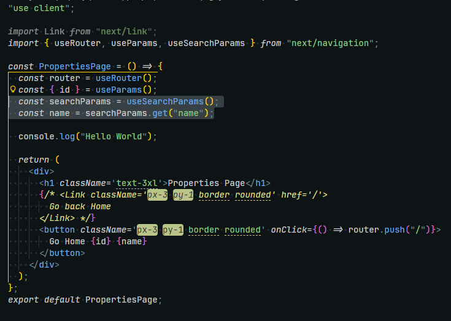
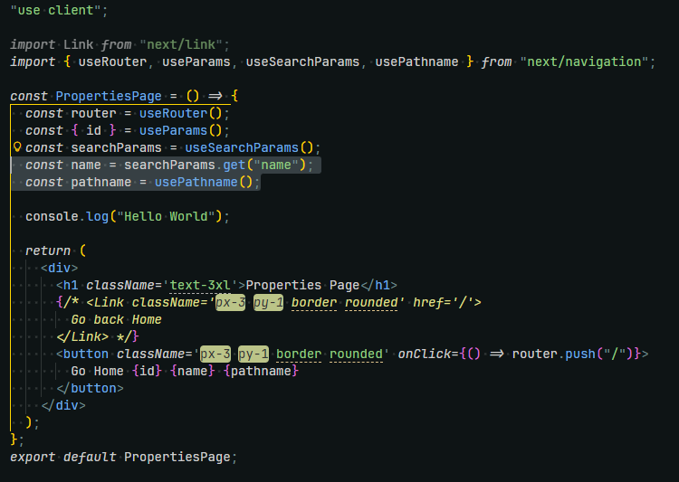

### Next API routing

success state
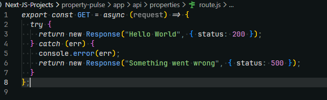
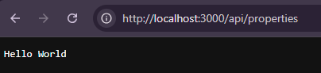

error state
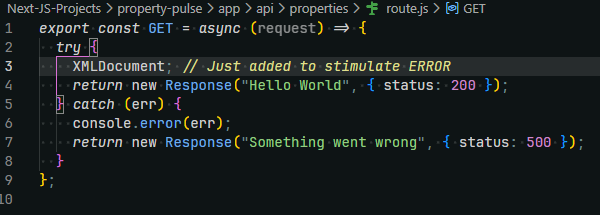
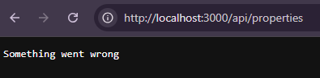
